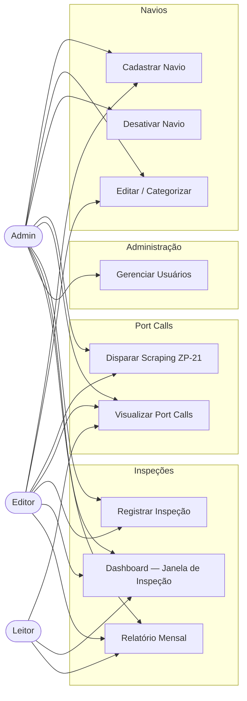
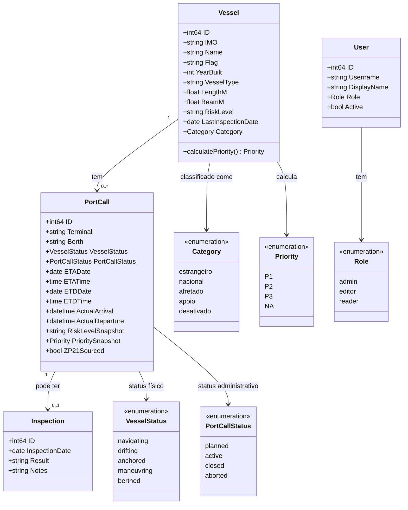
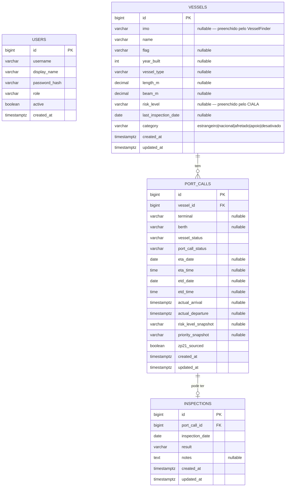

# psc-gvi

**Port State Control — Sistema interno do Grupo de Vistoria e Inspeção (GVI)**
Delegacia da Capitania dos Portos em Itajaí, SC, Brasil.

## Sobre

Sistema interno para apoio às atividades de inspeção PSC nos portos de Itajaí e Navegantes.
Automatiza a identificação de navios aptos à inspeção, registro de atracações e geração de relatórios mensais.

Parte da rotina diária consiste em: buscar navios previstos no ZP-21 → identificar o IMO via VesselFinder →
consultar histórico e grau de risco no CIALA → exibir no dashboard os navios na "janela de inspeção" (P1 ou P2).

## Stack

- **Backend:** Go + Gin
- **Frontend:** Go Templates + HTMX
- **Banco de dados:** PostgreSQL 16
- **Migrations:** Goose
- **Queries:** sqlc (SQL puro, sem ORM)
- **Deploy:** GCP Free Tier (e2-micro)

---

## Arquitetura

### Diagrama de Casos de Uso



---

### Diagrama de Classes



---

### Diagrama Entidade-Relacionamento



---

## Configuração local

```bash
# 1. Copie e preencha as variáveis de ambiente
cp .env.example .env

# 2. Suba os containers (app + banco)
docker compose up -d

# 3. Abra o terminal no devcontainer (VS Code) e aplique as migrations
goose -dir /workspace/migrations postgres "host=db port=5432 dbname=pscgvi user=pscgvi password=devpassword sslmode=disable" up

# 4. Inicie o servidor
go run ./cmd/server
```

Acesse: `http://localhost:8080/login` — credenciais iniciais: `admin` / `admin123`

## Variáveis de ambiente

Copie `.env.example` para `.env` e preencha os valores.
**Nunca comite o arquivo `.env`.**

| Variável | Descrição |
|----------|-----------|
| `ZP21_URL` | URL da página de manobras do ZP-21 (pode mudar sem aviso) |
| `DB_*` | Conexão com o PostgreSQL |
| `SESSION_SECRET` | Chave de assinatura dos cookies de sessão (mín. 32 chars) |
| `CIALA_USERNAME` | Login do portal CIALA |
| `CIALA_PASSWORD` | Senha do portal CIALA |
| `PORT` | Porta HTTP do servidor (padrão: 8080) |
| `ENV` | `development` ou `production` |

---

## Documentação

Os diagramas acima refletem o estado atual do domínio e serão atualizados a cada fase concluída.
Por estarem em formato Mermaid (texto no repositório), evoluem junto com o código sem ferramentas externas.

A documentação completa do projeto — guia de usuário, guia de operação e runbook de deploy —
está prevista para a **Fase 7**, antes do deploy em produção no GCP.

O histórico de decisões técnicas e o progresso de cada feature estão registrados em `docs/stories/`.
